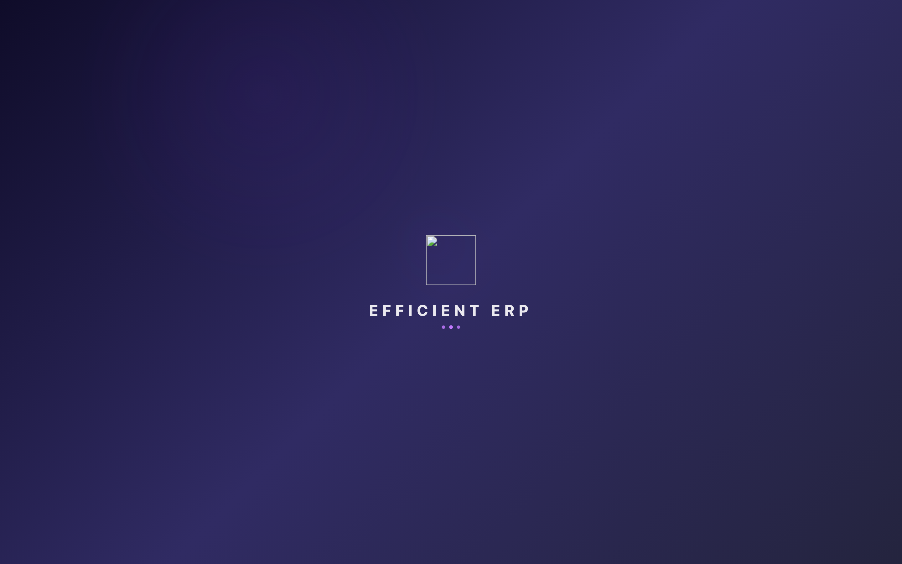

# react-os-shell

A desktop-style React UI shell — windows, taskbar, start menu, sticky notes, frosted-glass theming — plus bundled apps.

> **Status:** v0.8.0 — the bundled Email + Calendar apps and their Node IMAP/SMTP/CalDAV bridge have been removed. Mail is now the consuming app's responsibility.

### → [Live demo](https://victorymau.github.io/react-os-shell/)

A backend-less playground hosted on GitHub Pages. Wallpapers, themes, sticky notes, the spreadsheet, all wired to `localStorage` so the page survives a refresh. Source is in [`examples/demo/`](examples/demo/).

[](https://victorymau.github.io/react-os-shell/)

<sub>The screenshot is auto-captured against the deployed demo by [`.github/workflows/screenshot.yml`](.github/workflows/screenshot.yml). Run it manually: `gh workflow run "Capture hero screenshot"` (or use the Actions tab).</sub>

## What's in the box

**Shell:** `<Layout>`, `<StartMenu>`, `<Desktop>` (with sticky notes + folders), `<WindowManager>`, `<Modal>` (standard / compact / widget styles), `<PopupMenu>`, `<ConfirmDialog>`, `<GlobalSearch>` (Cmd-K), `<ShortcutHelp>`, `<NotificationBell>`, `<BugReportDetail>`, `<StatusBadge>`, frosted-glass theming.

**Apps:**
- **Utilities:** Calculator, Notepad, Spreadsheet, Weather, CurrencyConverter, PomodoroTimer, WorldClock, TodoList
- **Games:** Chess, Checkers, Minesweeper, Sudoku, Tetris, 2048
- **Documents / Web:** Preview, Documents, Files, Browser

Most apps ship in the `bundledApps` registry; a few (WorldClock, Notepad) want consumer-supplied prefs wiring to persist content across reloads. The bundled `Customization` settings page is also exported separately for consumers to register at `/settings/customization`.

**Hooks:** `useWindowManager`, `useTheme`, full hotkey/nav system.

**Themes:** light + dark (frosted-glass tinting; the package ships base styles, additional theme variants like pink/green/grey/blue can layer on top).

## Install

```bash
npm i react-os-shell
```

Peer deps you should already have in a typical React + Tailwind v4 app:

```bash
npm i react react-dom react-router-dom @tanstack/react-query react-hook-form \
      tailwindcss @headlessui/react @heroicons/react
```

## Quick start (~50 lines)

```tsx
// App.tsx
import { BrowserRouter, Routes, Route } from 'react-router-dom';
import { QueryClient, QueryClientProvider } from '@tanstack/react-query';
import {
  Layout,
  WindowManagerProvider,
  ConfirmProvider,
  ShellAuthProvider,
  ShellPrefsProvider,
  ShellEntityFetcherProvider,
  StatusBadgeProvider,
  setShellApiClient,
  setShellAuthBridge,
  setShellWindowRegistry,
  createWindowRegistry,
  useLocalStoragePrefs,
} from 'react-os-shell';
import { bundledApps } from 'react-os-shell/apps';
import 'react-os-shell/styles.css';
import axios from 'axios';

const apiClient = axios.create({ baseURL: '/api' });
setShellApiClient(apiClient);
setShellWindowRegistry(createWindowRegistry(bundledApps));
setShellAuthBridge({ user: { first_name: 'Demo' }, logout: () => {} });

const navSections = [
  { to: '/', label: 'Home' },
  { label: 'Games', items: bundledApps['/chess'] ? [
    { to: '/chess', label: 'Chess' },
    { to: '/tetris', label: 'Tetris' },
    { to: '/2048', label: '2048' },
  ] : [] },
];

const queryClient = new QueryClient();

export default function App() {
  const prefs = useLocalStoragePrefs('my-app');
  return (
    <QueryClientProvider client={queryClient}>
      <ConfirmProvider>
        <BrowserRouter>
          <ShellAuthProvider value={{ hasAnyPerm: () => true }}>
            <ShellPrefsProvider value={prefs}>
              <ShellEntityFetcherProvider value={(endpoint, id) => apiClient.get(`${endpoint}${id}/`).then(r => r.data)}>
                <StatusBadgeProvider groups={{}}>
                  <WindowManagerProvider>
                    <Routes>
                      <Route path="*" element={<Layout navSections={navSections} navIcons={{}} />} />
                    </Routes>
                  </WindowManagerProvider>
                </StatusBadgeProvider>
              </ShellEntityFetcherProvider>
            </ShellPrefsProvider>
          </ShellAuthProvider>
        </BrowserRouter>
      </ConfirmProvider>
    </QueryClientProvider>
  );
}
```

That gives you the full desktop with all utility, game, document and web apps reachable through the start menu. Add your own entity windows by extending the registry, and wire the notification / bug-report / sticky-note systems through optional config callbacks when you want them.

## Concepts

### Window registry

Every window the shell can open lives in a `WindowRegistry` map. Two entry shapes:

- **Page** — `{ component: LazyExoticComponent, label, size?, widget?, compact?, appStyle?, flushBody?, … }`. Opened via `openPage(routeKey)`. `flushBody` keeps the standard title bar + footer but drops the body padding (pair it with `<SidebarLayout>` for two-pane apps).
- **Entity** — `{ endpoint, render(entity, …), title(entity), footer?, … }`. Opened via `openEntity(typeKey, id)`. The shell GETs `${endpoint}${id}/` (via the consumer-supplied entity fetcher) and hands the result to `render`.

Compose multiple partial maps with `createWindowRegistry(...maps)`:

```ts
import { bundledApps } from 'react-os-shell/apps';
import { erpEntities } from './shell-config/erpEntities';

const windows = createWindowRegistry(bundledApps, erpEntities);
setShellWindowRegistry(windows);
```

### Nav sections

`Layout` renders the start menu from a `(NavSection | NavItem)[]` you pass in:

```ts
const navSections = [
  { to: '/', label: 'Home' },
  { label: 'Clients', items: [
    { to: '/orders', label: 'Sales Orders', perms: ['view_order'] },
    { to: '/clients', label: 'Clients' },
  ]},
];
```

Items with `perms` are filtered through `<ShellAuthProvider value={{ hasAnyPerm }}>`.

### useWindowManager

The hook every component uses to open / close / minimise windows:

```ts
const { openPage, openEntity, closeEntity, openWindows } = useWindowManager();

openPage('/calculator');
openEntity('order', 'uuid-123');
```

## API reference

All exports are named — `import { Modal, ... } from 'react-os-shell'`.

### Components

| Export | Purpose |
|---|---|
| `Layout` | Top-level shell — desktop + taskbar + start menu. Mount once inside your providers. |
| `StartMenu` / `Desktop` / `WindowManagerProvider` | Used internally by `Layout`; rarely instantiated directly. |
| `Modal`, `ModalActions`, `CopyButton`, `CancelButton` | Window primitive supporting standard / compact / widget styles. |
| `PopupMenu`, `PopupMenuItem`, `PopupMenuDivider`, `PopupMenuLabel` | Right-click / context-menu primitive. |
| `ConfirmProvider`, `confirm` | Imperative `confirm({ title, body })` returning a Promise<boolean>. |
| `GlobalSearch` | Cmd-K command palette. Pass `providers: SearchProvider[]` to add results. |
| `ShortcutHelp` | The keyboard cheatsheet shown on `?`. |
| `NotificationBell` | Taskbar bell — config via `<Layout notifications={…}>`. |
| `BugReportDetail` | Used inside an entity-window registry entry; reads from `<BugReportConfigProvider>`. |
| `StatusBadge` | Coloured pill rendering a status string. Map status→semantic group via `<StatusBadgeProvider groups={{...}}>`. |
| `SidebarLayout` | Two-pane layout with a drag-to-resize sidebar (`storageKey` persists the width). Pair with a `flushBody` window so the sidebar runs edge-to-edge. |

### Providers + setters

| Export | Use |
|---|---|
| `<ShellAuthProvider value={{ hasAnyPerm }}>` | Permission-filter nav items. |
| `<ShellPrefsProvider value={{ prefs, save }}>` | Where the shell reads/writes user prefs (theme, taskbar pos, sticky notes, …). Use `useLocalStoragePrefs(key)` for a backend-less default. |
| `<ShellEntityFetcherProvider value={(endpoint, id) => …}>` | How the modal stack fetches entity data. |
| `<BugReportConfigProvider value={{ submit, list?, resolve? }}>` | Wire the bug-report flow to your backend. |
| `<DesktopHostProvider value={{ stickyResolver?, saveShortcuts?, … }}>` | Sticky-note ref resolver + persistence callbacks. |
| `<StatusBadgeProvider groups={{ status: 'success' \| ... }}>` | Status string → semantic group. |
| `setShellApiClient(axios)` | Module-level: register your axios instance once. |
| `setShellAuthBridge({ user, logout })` | Module-level: register user identity / logout handler. |
| `setShellWindowRegistry(registry)` | Module-level: register your composed `WindowRegistry`. |

### Hooks

| Export | Purpose |
|---|---|
| `useWindowManager()` | `{ openPage, openEntity, closeEntity, openWindows, … }` |
| `useTheme()` | `{ theme, resolved }` — current theme + system-resolved value. |
| `useNewHotkey(handler)` | Cmd/Ctrl+N — for "create new entity" buttons. |
| `useEditHotkey(handler)` | Alt+Shift+E — for "edit" toggle. |
| `useModalNav({ onPrev, onNext })` | ←/→ to step through siblings inside a modal. |
| `useModalSave(handler)` | Cmd-S inside a modal. |
| `useModalDuplicate(handler)` | Alt-D inside a modal. |
| `useTableNav({ rows, cols, onCell })` | Arrow-key cell navigation in editable grids. |
| `useMultiModal()` | Manages multi-window stacking + activate/blur. |
| `useShellAuth() / useShellPrefs() / useShellEntityFetcher() / useBugReport() / useDesktopHost()` | Context readers — the shell uses these internally; consumers may also call them. |

### Apps barrel — `react-os-shell/apps`

| Export | Type |
|---|---|
| `bundledApps` | `WindowRegistry` — 12 ready-to-mount apps. |
| `utilityApps`, `gameApps`, `documentApps`, `webApps` | Subsets of `bundledApps`. |
| `Calculator`, `Spreadsheet`, `Weather`, `CurrencyConverter`, `PomodoroTimer`, `Chess`, `Checkers`, `Sudoku`, `Tetris`, `Game2048`, `TodoList`, `Browser` | Lazy components — use directly in custom registry entries. |

### Misc

| Export | Notes |
|---|---|
| `createWindowRegistry(...maps)` | Variadic merge — later partials override earlier on the same key. |
| `isPageEntry`, `isEntityEntry` | Type guards for `WindowRegistryEntry`. |
| `glassStyle()` | Returns the theme-aware frosted-glass `style` object. |
| `reportBug(submit)` | Captures a screenshot via `getDisplayMedia`, opens the dialog, hands the payload to your `submit`. |
| `formatDate(iso)` | Locale-aware date formatter. |
| `toast.success / .error / .info` | Toast notifications — auto-mounts container. |
| `Kbd` constants — `MOD`, `ALT`, `SHIFT`, `ENTER`, `ALT_SHIFT_E`, `CMD_K`, … | Symbol constants for rendering keyboard shortcuts. |

## Why it exists

Most "desktop UI" demos on the web are toys with hardcoded windows and no escape hatch. This one was extracted from a working ERP where every entity (sales orders, invoices, vendors, …) opens as its own window with consistent header, footer, hotkeys, depth stacking, and split-view. The shell is **fully decoupled** from any specific backend — every subsystem that needs server data (notifications, bug reports, desktop shortcuts, search, entity fetching) takes its data through callback configs supplied by the consumer. Drop-in localStorage fallbacks ship for prefs and sticky notes so the package works out of the box without a backend.

## Examples

- [`examples/demo`](examples/demo/) — small Vite app showcasing the shell + bundled apps with mock data. Live at [victorymau.github.io/react-os-shell](https://victorymau.github.io/react-os-shell/), deployed automatically by [`.github/workflows/pages.yml`](.github/workflows/pages.yml) on every push to `main`.

## Contributing

PRs welcome. Open an issue first for non-trivial changes so we can align on shape.

## License

[MIT](./LICENSE)
