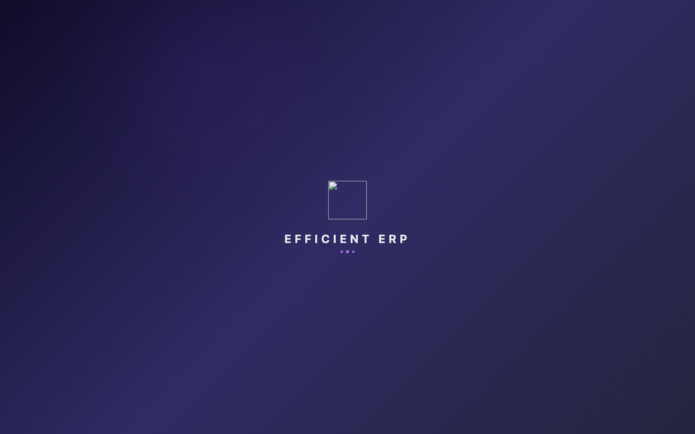

# react-os-shell

A desktop-style React UI shell — windows, taskbar, start menu, sticky notes, frosted-glass theming — plus bundled apps.

> **Status:** v0.8.0 — the bundled Email + Calendar apps and their Node IMAP/SMTP/CalDAV bridge have been removed. Mail is now the consuming app's responsibility.

### → [Live demo](https://victorymau.github.io/react-os-shell/)

A backend-less playground hosted on GitHub Pages. Wallpapers, themes, sticky notes, the spreadsheet, all wired to `localStorage` so the page survives a refresh. Source is in [`examples/demo/`](examples/demo/).

[](https://victorymau.github.io/react-os-shell/)

<sub>The screenshot is auto-captured against the deployed demo by [`.github/workflows/screenshot.yml`](.github/workflows/screenshot.yml). Run it manually: `gh workflow run "Capture hero screenshot"` (or use the Actions tab).</sub>

## What's in the box

**Shell:** `<Layout>`, `<StartMenu>`, `<Desktop>` (with sticky notes + folders), `<WindowManager>`, `<Modal>` (standard / compact / widget styles), `<PopupMenu>`, `<ConfirmDialog>`, `<GlobalSearch>` (Cmd-K), `<ShortcutHelp>`, `<NotificationBell>`, `<StatusBadge>`, `<SearchableSelect>`, frosted-glass theming.

**UI primitives:** `<Button>`, `<Input>`, `<Textarea>`, `<Select>`, `<Checkbox>`, `<Radio>`, `<FormField>`, `<Label>`, `<Card>` / `<StatCard>`, `<Avatar>` / `<AvatarGroup>`, `<Banner>`, `<Tabs>`, `<Accordion>`, `<Tooltip>`, `<Pagination>`, `<MetricBar>`, and dependency-free `<Sparkline>` / `<LineChart>` / `<BarChart>` / `<DonutChart>` charts.

**Page templates:** ready-made screens composed from the primitives — `<DashboardTemplate>`, `<DataTablePage>`, `<FormLayoutPage>`, `<CheckoutTemplate>`, `<EmailTemplate>`, `<ChatTemplate>`, `<GalleryTemplate>`, `<AuthScreen>`, `<ErrorPage>`. `<ErrorBoundary>` catches a render crash and shows the 500 page in place of a blank screen.

**Apps:**
- **Utilities:** Calculator, Notepad, Spreadsheet, Weather, CurrencyConverter, PomodoroTimer, WorldClock, TodoList
- **Documents / Web:** Preview, Documents, Files, Browser

Most apps ship in the `bundledApps` registry; a few (WorldClock, Notepad) want consumer-supplied prefs wiring to persist content across reloads. The bundled `Customization` settings page is also exported separately for consumers to register at `/settings/customization`.

**Hooks:** `useWindowManager`, `useWindowDirty`, `useTheme`, full hotkey/nav system.

**Themes:** light + dark (frosted-glass tinting; the package ships base styles, additional theme variants like pink/green/grey/blue can layer on top).

## Install

```bash
npm i react-os-shell
```

Peer deps you should already have in a typical React + Tailwind v4 app:

```bash
npm i react react-dom react-router-dom @tanstack/react-query react-hook-form \
      tailwindcss @headlessui/react @heroicons/react
```

All of those except `react` / `react-dom` are declared **optional** peers. The
shell's components need them — a portal that drops one gets a module-not-found at
build — but a consumer taking only `react-os-shell/markup` needs none of them, and
`autoInstallPeers` would otherwise install the lot on its behalf.

**`pdfjs-dist` is ranged, not wildcarded.** The Preview viewer accepts
`^5.6.205 || ^6.0.0`. pdf.js removes API across majors — 6.0 dropped the
bare-string `getDocument(url)` this viewer used to call, and an unbounded range
let that arrive as a routine upgrade — so a new major goes into the range only
once the viewer has been checked against it.

Preview needs no wiring for pdf.js's WebAssembly decoders. It names
`pdfjs-dist/wasm/jbig2.wasm` and `pdfjs-dist/wasm/openjpeg.wasm` through
`new URL(..., import.meta.url)`, so a production bundle emits them from your own
installed copy and hands them to pdf.js without reaching a CDN. Those are the
decoders JBIG2 (scanned) and JPEG 2000 images need; without a location pdf.js
declines to fetch them and drops such images from an otherwise-rendered page.

Two caveats worth knowing. The specifier is resolved by your bundler at build
time, so this is verified for production builds; a dev server that pre-bundles
dependencies may not resolve it, in which case you get exactly the previous
behaviour rather than a new failure. And a host that would rather serve the
whole `pdfjs-dist/wasm/` directory itself sets
`window.__REACT_OS_SHELL_PDF_WASM__` to its URL before opening a Preview window.

## Quick start (~50 lines)

```tsx
// App.tsx
import { BrowserRouter, Routes, Route } from 'react-router-dom';
import { QueryClient, QueryClientProvider } from '@tanstack/react-query';
import {
  Layout,
  WindowManagerProvider,
  ConfirmProvider,
  ShellAuthProvider,
  ShellPrefsProvider,
  ShellEntityFetcherProvider,
  StatusBadgeProvider,
  setShellApiClient,
  setShellAuthBridge,
  setShellWindowRegistry,
  createWindowRegistry,
  useLocalStoragePrefs,
} from 'react-os-shell';
import { bundledApps } from 'react-os-shell/apps';
import 'react-os-shell/styles.css';
import axios from 'axios';

const apiClient = axios.create({ baseURL: '/api' });
setShellApiClient(apiClient);
setShellWindowRegistry(createWindowRegistry(bundledApps));
setShellAuthBridge({ user: { first_name: 'Demo' }, logout: () => {} });

const navSections = [
  { to: '/', label: 'Home' },
  { label: 'Utilities', items: [
    { to: '/calculator', label: 'Calculator' },
    { to: '/notepad', label: 'Notepad' },
    { to: '/files', label: 'Files' },
  ] },
];

const queryClient = new QueryClient();

export default function App() {
  const prefs = useLocalStoragePrefs('my-app');
  return (
    <QueryClientProvider client={queryClient}>
      <ConfirmProvider>
        <BrowserRouter>
          <ShellAuthProvider value={{ hasAnyPerm: () => true }}>
            <ShellPrefsProvider value={prefs}>
              <ShellEntityFetcherProvider value={(endpoint, id) => apiClient.get(`${endpoint}${id}/`).then(r => r.data)}>
                <StatusBadgeProvider groups={{}}>
                  <WindowManagerProvider>
                    <Routes>
                      <Route path="*" element={<Layout navSections={navSections} navIcons={{}} />} />
                    </Routes>
                  </WindowManagerProvider>
                </StatusBadgeProvider>
              </ShellEntityFetcherProvider>
            </ShellPrefsProvider>
          </ShellAuthProvider>
        </BrowserRouter>
      </ConfirmProvider>
    </QueryClientProvider>
  );
}
```

That gives you the full desktop with all utility, document and web apps reachable through the start menu. Add your own entity windows by extending the registry, and wire the notification / bug-report / sticky-note systems through optional config callbacks when you want them.

## Concepts

### Window registry

Every window the shell can open lives in a `WindowRegistry` map. Two entry shapes:

- **Page** — `{ component: LazyExoticComponent, label, size?, widget?, compact?, appStyle?, flushBody?, … }`. Opened via `openPage(routeKey)`. `flushBody` keeps the standard title bar + footer but drops the body padding (pair it with `<SidebarLayout>` for two-pane apps).
- **Entity** — `{ endpoint, render(entity, …), title(entity), footer?, … }`. Opened via `openEntity(typeKey, id)`. The shell GETs `${endpoint}${id}/` (via the consumer-supplied entity fetcher) and hands the result to `render`.

Compose multiple partial maps with `createWindowRegistry(...maps)`:

```ts
import { bundledApps } from 'react-os-shell/apps';
import { erpEntities } from './shell-config/erpEntities';

const windows = createWindowRegistry(bundledApps, erpEntities);
setShellWindowRegistry(windows);
```

### Nav sections

`Layout` renders the start menu from a `(NavSection | NavItem)[]` you pass in:

```ts
const navSections = [
  { to: '/', label: 'Home' },
  { label: 'Clients', items: [
    { to: '/orders', label: 'Sales Orders', perms: ['view_order'] },
    { to: '/reports/ar', label: 'Accounts Receivable Report', menuLabel: 'AR Report' },
    { to: '/clients', label: 'Clients' },
  ]},
];
```

Start-menu rows are always one line. Keep `label` as the full semantic name;
when it does not fit the narrowest menu size, supply `menuLabel` with an
established domain abbreviation such as `AR`, `AP`, `PO`, or `GRNI`. The shell
shows the compact wording, keeps matching search against the full `label`, and
truncates as a final overflow guard. Do not invent a new acronym merely to make
a row shorter.

An abbreviated row is named `"<menuLabel>, <label>"` to assistive technology —
that order matters, because an accessible name must *contain* the text on
screen for voice control to act on it (WCAG 2.5.3). A row showing its own full
`label` gets no `aria-label` at all; its text content already is the name. The
native tooltip appears only where the visible text is not the whole name: an
explicit `menuLabel`, or a label the row had to clip.

Items with `perms` are filtered through `<ShellAuthProvider value={{ hasAnyPerm }}>`.

`perms` is an **any-of** test: the row shows if the user holds at least one of them. When a row should appear only for someone holding *every* permission in a set, use `allPerms` instead — it is an **all-of** test, and the two can be combined on the same entry:

```ts
// Reaching price sheets puts the row in the menu; seeing prices is what the
// page itself needs. Adding both to `perms` would show it to MORE people.
{ to: '/suppliers/price-sheets', label: 'Price Sheets',
  perms: ['view_supplierpricesheet'], allPerms: ['view_supplier_prices'] },
```

Reach for `allPerms` whenever the permission that lists a destination is broader than the one its page enforces — otherwise the row renders and then refuses on click. Both fields work on sections as well as items, and on nested children.

#### Nesting

An item's `children` are items, so a menu nests as deeply as you configure it — there is no maximum:

```ts
{ label: 'HR', items: [
  { to: '/hr/recruitment', label: 'Recruitment', children: [
    { to: '/hr/recruitment/jobs', label: 'Job Postings', children: [
      { to: '/hr/recruitment/jobs/open', label: 'Open' },
      { to: '/hr/recruitment/jobs/closed', label: 'Closed' },
    ]},
  ]},
]}
```

Each level behaves the same way: in the start menu it opens a flyout on hover (flipping to the left of its parent when it runs out of screen), and in the sidebar it expands as an accordion, indented one more step. A group's `to` is a synthetic key by convention — no page sits behind it, and clicking the row opens its submenu rather than navigating. A group whose every branch is permission-hidden is dropped entirely, so a user never gets a row that opens onto nothing.

### useWindowManager

The hook every component uses to open / close / minimise windows:

```ts
const { openPage, openEntity, closeEntity, openWindows } = useWindowManager();

openPage('/calculator');
openEntity('order', 'uuid-123');
```

### useWindowDirty

Register controlled unsaved state from a component rendered by `PageWindow`:

```tsx
const [dirty, setDirty] = useState(false);
useWindowDirty(dirty);
```

The page window uses the standard `Modal` discard confirmation while any
mounted registration is dirty. Set the value to `false` after save or discard;
unmounting also removes the registration. Calls outside a managed page window
are ignored.

## API reference

All exports are named — `import { Modal, ... } from 'react-os-shell'`.

### Components

| Export | Purpose |
|---|---|
| `Layout` | Top-level shell — desktop + taskbar + start menu. Mount once inside your providers. `branding={{ productName, logo, tagline }}` sets the visual identity in one object — start-menu button, startup splash, logout cover, mobile landing; its fields win over the older loose `productName`/`productIcon` props. The About dialog and What's New changelog stay on `DesktopHostConfig`. |
| `BrandMark` | Aspect-preserving tenant mark for favicon, compact-icon and wordmark slots, with load-failure fallback, neutral monogram behaviour and optional tone-aware contrast treatment. |
| `BrandAssetEditor` | Shared staged upload/remove lifecycle with one enforced file contract and standard browser, search-result and shell-slot previews. Persistence is injected through `onSave` and `onRemove`. |
| `StartMenu` / `Desktop` / `WindowManagerProvider` | Used internally by `Layout`; rarely instantiated directly. |
| `Modal`, `ModalActions`, `CopyButton`, `CancelButton` | Window primitive supporting standard / compact / widget styles. |
| `PopupMenu`, `PopupMenuItem`, `PopupMenuDivider`, `PopupMenuLabel` | Right-click / context-menu primitive. |
| `DropdownMenu` | Trigger-owned action menu with shared dismissal and keyboard behaviour. Use `side="top"` for a trigger in a bottom action bar; the default `side="bottom"` suits toolbar and row actions. |
| `ConfirmProvider`, `confirm` | Imperative `confirm({ title, body })` returning a Promise<boolean>. |
| `GlobalSearch` | Cmd-K command palette. Pass `providers: SearchProvider[]` to add results. |
| `ShortcutHelp` | The keyboard cheatsheet shown on `?`. |
| `NotificationBell` | Taskbar bell — config via `<Layout notifications={…}>`. |
| `BugReportDetail` | Used inside an entity-window registry entry; reads from `<BugReportConfigProvider>`. |
| `StatusBadge` | Coloured pill rendering a status string. Map status→semantic group via `<StatusBadgeProvider groups={{...}}>`. `label` overrides the derived text for a status that arrived from elsewhere; the colour still comes from `status`. |
| `SidebarLayout` | Two-pane layout with a drag-to-resize sidebar (`storageKey` persists the width). Pair with a `flushBody` window so the sidebar runs edge-to-edge. |
| `SidebarNavItem`, `SidebarGroupLabel` | Filter-sidebar button (optional `count` badge and `severity` marker dot) plus its group heading. Roll the severity up in the app; omitting it renders exactly as before it existed. An unrecognised `severity` renders a visible "unknown" marker and logs — it never silently disappears. |
| `MetricBar` | Value + proportional bar with optional `warn` / `crit` threshold ticks — the CPU / memory / disk row. `value={null}` renders "no data" (dashed empty track), never a zero-width bar; with no thresholds the fill stays grey rather than claiming health. `max` must be a positive finite number — given `0`/`NaN` the row prints the value but draws no bar, rather than dividing by zero into a full one. |
| `Button`, `Input`, `Textarea`, `Select`, `Checkbox`, `Radio`, `FormField`, `Label` | Form controls — controlled (`value`/`onChange`); `Input`/`Textarea` forward native props for react-hook-form. |
| `FormErrorSummary` | The error list at the top of a failed form (WCAG 3.3.1, the GOV.UK pattern): takes focus when errors appear, each message is a link that focuses the offending control by its `FormField` id. Renders nothing while `errors` is empty. |
| `TagInput` | Multi-value field — chosen values as removable chips, typing filters the option list in the same dropdown SearchableSelect uses. `allowFreeText` admits unlisted entries; Backspace in the empty input removes the last chip. The value array stays duplicate-free by construction. |
| `DatePicker`, `TimePicker`, `DateTimePicker`, `DateRangePicker` | Date/time fields. The first three wrap the platform's own inputs in the kit's field styling; all are careful to speak LOCAL dates and wall-clock times (never `toISOString`). `TimePicker` hands back an `HH:MM` string — a time of day names no calendar day, so it never invents a Date. `DateRangePicker` takes `fullWidth` to fill a filter-grid cell instead of shrink-wrapping its label. |
| `Card`, `StatCard` | Surface panel (optional header/footer) + dashboard metric tile. |
| `Avatar`, `AvatarGroup` | User avatar with initials fallback + status dot; overlapping stack with +N overflow. |
| `Banner` | Static in-flow alert (`tone`: info / success / warning / danger). |
| `Tabs`, `Accordion`, `Tooltip` | Controlled tab strip, collapsible sections, frosted hover tooltip. |
| `Stepper` | A linear wizard's progress strip — numbered circles, connectors, `aria-current="step"`. Controlled like Tabs; completed steps are clickable to go back (when `onChange` is wired), upcoming steps never are — moving forward belongs to the wizard's own Continue button, behind its validation. |
| `Pagination` | Numbered page control (pairs with tables; complements `ListFooter`). |
| `Sparkline`, `LineChart`, `BarChart`, `DonutChart`, `ScatterChart` | Dependency-free inline-SVG charts (`currentColor`-themed). `LineChart` is the multi-series trend with optional scale, legend, dots and area fill. `ScatterChart` takes `xDomain` / `yDomain` to override the derived axis, and `xScale` / `yScale` of `'log'` for a long tail; a point outside a supplied domain is dropped and counted in the accessible label. |
| `BulkImportGrid` | Paste-or-upload bulk entry with column mapping, duplicate review and optional sum-merge. Hands resolved rows to `onImport`; owns no persistence. |
| `UndoProvider`, `UndoControls` | One undo stack per form window, covering its fields, line items and bulk imports. Wrap the form in the provider, register state with `useUndoable`, drop the controls wherever the form's actions live. Binds ⌘Z / ⇧⌘Z (and Ctrl+Y) except while the caret is in a field, where the browser's own undo wins. `WindowManager` already mounts one per window, scoped with `windowId` so a keypress reaches only the frontmost window; pass `windowId` yourself for any provider you mount outside a `<Modal>`, or two open windows will step back together. Offered to anyone who may edit the record — gate with `canEdit` and/or `perms`; a reader sees no controls and records no history. The shell-level provider cannot know the record's permissions, so a read-only form nests its own `<UndoProvider canEdit={false}>` to shadow it. |
| `Calendar` | Month grid with full keyboard navigation (arrows, Home/End, PageUp/Down) and `role="grid"` semantics. Single or range. The shared grid behind `DatePicker` and `DateRangePicker`. |
| `DashboardTemplate`, `DataTablePage`, `FormLayoutPage`, `CheckoutTemplate`, `EmailTemplate`, `ChatTemplate`, `GalleryTemplate`, `AuthScreen`, `ErrorPage` | Zero-prop starter page templates composed from the primitives. |
| `ErrorBoundary` | Catches a render crash and shows `ErrorPage` 500 rather than a blank screen. `showDetails` is off by default, so a visitor is never shown the stack; the fallback is `role="alert"`. Takes `onError` for reporting and `resetKeys` to recover on navigation. |

### Providers + setters

| Export | Use |
|---|---|
| `<ShellAuthProvider value={{ hasAnyPerm }}>` | Permission-filter nav items. |
| `<ShellPrefsProvider value={{ prefs, save }}>` | Where the shell reads/writes user prefs (theme, taskbar pos, sticky notes, …). Use `useLocalStoragePrefs(key)` for a backend-less default. Since 4.92.0 it is also how `<EntityList>` / `<ResizableTable>` column config and sort persist: with no provider mounted, `useShellPrefs()` reads empty and drops saves, so both silently degrade to localStorage-only and never reach the user's profile. |
| `<ShellStringsProvider value={{ … }}>` | Translates the shell's own strings — window controls, taskbar hints, the logout cover, About/What's New, picker and table defaults, the help viewer. English works with NO provider; the override is a typed partial merged per section, so an incomplete catalog falls back rather than breaking. Prop-level text (`emptyText`, placeholders) always wins over the catalog. |
| `<ShellEntityFetcherProvider value={(endpoint, id) => …}>` | How the modal stack fetches entity data. |
| `<BugReportConfigProvider value={{ submit, list?, resolve? }}>` | Wire the bug-report flow to your backend. |
| `<DesktopHostProvider value={{ stickyResolver?, saveShortcuts?, … }}>` | Sticky-note ref resolver + persistence callbacks. |
| `<StatusBadgeProvider groups={{ status: 'success' \| ... }}>` | Status string → semantic group. |
| `<PortalBrandingProvider load={...} fallback={...}>` | Loads public hostname-scoped Company Profile identity before authentication, applies its favicon and optional derived document title, and exposes it through `usePortalBranding()`. |
| `setShellApiClient(axios)` | Module-level: register your axios instance once. |
| `setShellAuthBridge({ user, logout })` | Module-level: register user identity / logout handler. |
| `setShellWindowRegistry(registry)` | Module-level: register your composed `WindowRegistry`. |

### Hooks

| Export | Purpose |
|---|---|
| `useWindowManager()` | `{ openPage, openEntity, closeEntity, openWindows, … }` |
| `useWindowDirty(dirty)` | Registers controlled unsaved state with the enclosing `PageWindow`; multiple registrations aggregate with any-dirty semantics, and calls outside a managed page window are ignored. |
| `useTheme()` | `{ theme, resolved }` — current theme + system-resolved value. |
| `useNewHotkey(handler)` | Cmd/Ctrl+N — for "create new entity" buttons. |
| `useEditHotkey(handler)` | Alt+Shift+E — for "edit" toggle. |
| `useModalNav({ onPrev, onNext })` | ←/→ to step through siblings inside a modal. |
| `useModalSave(handler)` | Cmd-S inside a modal. |
| `useModalDuplicate(handler)` | Alt-D inside a modal. |
| `useTableNav({ rows, cols, onCell })` | Arrow-key cell navigation in editable grids. |
| `useUndoableState(initial, { label, coalesceKey })` | `useState`, with the value in the window's undo stack — a rename, not an extra line. State left as plain `useState` stays out of the history, which is where transient UI, fetched data and validation output belong. |
| `useUndoable(value, apply, { label, coalesceKey })` | The explicit form, for state whose setter the component does not own. `apply` is the setter you already have. `coalesceKey` folds a run of typing into one step. Register the state itself, never a value derived on the way in (`rows.filter(...)`) — changes are detected by identity, so a fresh array each render reads as a change every render. |
| `useUndo()` | `{ undo, redo, canUndo, canRedo, undoLabel, clear, baseline }` for the enclosing `UndoProvider` — for custom UI, to `clear()` the history after a save, or to `baseline()` it after a load. Call `baseline()` in the same effect that assigns a fetched record, or the load itself becomes the oldest step and the user's first ⌘Z hands back the empty form. |
| `useMultiModal()` | Manages multi-window stacking + activate/blur. |
| `useShellAuth() / useShellPrefs() / useShellEntityFetcher() / useBugReport() / useDesktopHost()` | Context readers — the shell uses these internally; consumers may also call them. |

### Apps barrel — `react-os-shell/apps`

| Export | Type |
|---|---|
| `bundledApps` | `WindowRegistry` — 12 ready-to-mount apps. |
| `utilityApps`, `documentApps`, `webApps` | Subsets of `bundledApps`. |
| `Calculator`, `Spreadsheet`, `Weather`, `CurrencyConverter`, `PomodoroTimer`, `TodoList`, `Browser` | Lazy components — use directly in custom registry entries. |
| `BUILTIN_APP_INFO` | Per-app metadata for the document/web apps (Spreadsheets, Notepad, Documents, Preview, Files, Browser): display name, independent app version and one-line description. Drives each app's "About" dialog (window title menu → About <App>), which also shows the shell version. |

### UI kit without the window manager — `react-os-shell/ui`

Not every app that wants this package's components wants a desktop. A
point-of-sale till is one full-screen screen; a portal may keep its own routed
pages and sidebar. Both still want the buttons, inputs, cards, badges, tables
and charts.

```tsx
import { Button, Card, Banner, FormField, Input } from 'react-os-shell/ui';
import 'react-os-shell/ui.css';
```

**It reaches nothing but `react` and `react-dom`.** None of the optional peers —
no `react-router-dom`, `@tanstack/react-query`, `axios`, `@headlessui/react` or
`@heroicons/react` — which matters because they are declared *optional*, so a
consumer who has not installed them gets an unresolvable import rather than a
degraded style. CI asserts it against the built artifact
(`scripts/verify-dist.mjs`), not just the source, because leakage can arrive
through a shared chunk.

What you get: every form control, the display and layout primitives
(`Card`/`StatCard`, `Avatar`, `Banner`, `Tabs`, `Accordion`, `Tooltip`,
`StatusBadge`, `ColoredBadge`, `EmptyState`, `PageHeader`, `Spinner`,
`Breadcrumbs`, `TopNav`, `SidebarLayout`, `MetricBar`, `Markdown`,
`HelpCenter`, `EditableGrid`, `SearchableSelect`, `PopupMenu`), the charts, all
nine page templates, the pageless data primitives (`Pagination`, `Kanban`,
`ListFooter`, `ListLoadError`), `toast`, and the theming hooks (`useTheme`,
`resolveTheme`, `applyThemePrefs`) — you need those last ones to reach dark mode
or an accent at all, since both work by stamping `data-theme`.

What you do not get: `Modal` and the window manager, `Layout`, `Desktop`,
`StartMenu`, `GlobalSearch`, the settings panels, the bundled apps, and the
components that reach an optional peer for their own reasons (`EntityList`,
`ResizableTable` and the react-query data hooks, `FilterBar`, `UndoControls`,
`BulkImportGrid`, `ConfirmProvider`/`confirm`).

**Stylesheets: import exactly one.** `ui.css` is the kit; `styles.css` is the
umbrella over the kit *plus* the window/taskbar/desktop rules. Taking both
doubles every rule. `ui.css` deliberately does not `@import "tailwindcss"` — you
supply Tailwind v4 yourself (every consumer already does), which also lets an
app mid-migration off another component library take the theme and utility
layers without preflight.

`react-os-shell` (the root entry) is unchanged and remains a superset: same
components, same bindings, plus the shell.

### Brand surfaces — `react-os-shell/brand.css`

For output that is not a portal window — a report, a published artifact, a
proposal, an HTML email, a shop page. Those have no React and no build step,
so they cannot compose the kit; they link one stylesheet instead:

```html
<link rel="stylesheet" href="https://unpkg.com/react-os-shell/dist/brand.css">
```

It is `styles.css` compiled and self-contained, plus the tokens a page without
utility classes cannot express (accent and `--accent-text`/`--on-accent`,
status hues and their `-text` variants, radius, type), plus the **report
primitives** — a small semantic layer in
`@layer components`, so a utility on the same element still wins:

| Group | Classes |
|---|---|
| Shell | `ef-report` `ef-shell` `ef-skip-link` `ef-masthead` `ef-identity` `ef-logo-light` `ef-logo-dark` `ef-document-meta` `ef-footer` |
| Opening, structure | `ef-opening` `ef-opening-claim` `ef-opening-proof` `ef-section` `ef-section-title` `ef-flow` `ef-reading` `ef-peers` |
| Type roles | `ef-label` `ef-caption` `ef-mono` `ef-numeric` `ef-visually-hidden` `ef-sources` |
| Figures | `ef-stat-strip` `ef-stat` `ef-stat-label` `ef-stat-value` `ef-stat-unit` `ef-stat-detail` `ef-unavailable` |
| Evidence | `ef-table-wrap` (caption, header, baseline-aligned cells, `ef-numeric` columns) · `ef-status[data-status]` over the nine groups |
| Bars, charts | `ef-bar-list` `ef-bar-label` `ef-bar-track` `ef-bar-fill` (`style="--ef-bar: 48%"`) `ef-bar-value` · `ef-chart` `ef-series-1…6` `ef-series-stroke` `ef-series-fill` `ef-chart-axis` `ef-chart-gridline` `ef-chart-label` |
| Controls | `ef-field` `ef-helper` `ef-error` `ef-button[data-variant]` |

A page that stamps no `data-theme` follows the reader's OS preference: the
stylesheet carries the dark ramp under `prefers-color-scheme`, guarded so any
explicit stamp wins. Utility colour classes remap only under
`[data-theme="dark"]`, so a page that paints with utilities stamps the
attribute itself.

The list is the API. The stylesheet is compiled, so an `ef-` name outside it
renders as nothing, the same as `h-[440px]`. The layout primitives exist to
make the recurring generated-page defects unexpressible rather than merely
detectable: `ef-table-wrap` owns the full width of its section, `ef-bar-list`
owns one shared label, plot and value lane, `ef-stat-strip` owns the peer
grid. The organisation contract that governs these surfaces, and the audit
that checks them, live in the EFFICIENT harness (`52-brand-surface.md`).

### Editorial markup — `react-os-shell/markup`

One grammar for copy a human types into a plain text box, so a toolbar button and
a parser can never disagree about what a delimiter means: `**bold**`, `_italic_`,
`~~strike~~`, `==highlight==` (the brand accent, applied to a selection).

**Its own subpath because it imports nothing** — no React, no JSX, no DOM, none
of this package's peers. A public site can take the rule without inheriting a 3D
viewer and a PDF renderer; `dist/markup/index.js` is a standalone file with zero
import statements.

What is shared is the RULE, not the rendering. A web renderer paints with
theme-token classes and an email renderer must inline every style, so each host
keeps its own renderer and walks the same token list.

| Export | Notes |
|---|---|
| `applyMark(text, start, end, style)` | Pure writer behind a toolbar button — returns the new text plus where the selection should sit. Pressing the same button again unwraps. |
| `MARKUP_TOOLS`, `COPY_FIELD_TOOLS`, `markupTools(styles)` | Button descriptors, and the four a copy field offers (bold / italic / strike / highlight). A host renders its own buttons; only the rule is shared. |
| `tokenizeInline(value, rules)` | Parses to `InlineToken[]`. Tokens ALTERNATE, starting and ending with a `text` token that may be empty — a renderer that wraps every segment depends on the empty ones to keep its markup stable. |
| `stripInline(value, rules)` | The plain words — the only correct source for an `alt`, an `aria-label` or a structured-data field. Deleting delimiter characters by hand breaks the moment the grammar grows a marker. |
| `STANDARD_MARKUP` | The four marks above. |
| `STOREFRONT_MARKUP`, `CAMPAIGN_MARKUP` | Standard plus a host's own LEGACY runs, so already-published copy keeps rendering as it does today. Designed to be deleted once stored content has been converted. |

Two delimiter choices worth knowing. Italic is `_phrase_`, not `*phrase*`,
because a single asterisk already means the accent colour in the products that
use this. And `_` never fires inside a word (CommonMark's own rule), which is
what stops a mail-merge line holding `{{first_name}}` and `{{last_name}}` from
italicising everything between them — checked with plain character tests, never a
lookbehind, which is a parse error on Safari below 16.4.

### Markdown — `react-os-shell/markdown`

CommonMark + GFM for a body a person or a service WROTE: a note, a chat message,
a bug report, a help article. React elements out; no HTML string exists at any
point in the pipeline.

**Its own subpath, for the mirror image of `markup`'s reason.** It is the one
module in this package that needs a third-party runtime, so `react-markdown`,
`remark-gfm` and `remark-breaks` are declared **optional** peers and only a
consumer who imports this subpath ever installs them. The package's
`dependencies` stay empty. Cost when you do take it: ~46 KB gzipped.

```bash
npm i react-markdown remark-gfm remark-breaks
```

```tsx
import Markdown from 'react-os-shell/markdown';
import 'react-os-shell/ui.css';

<Markdown>{report.description}</Markdown>
<Markdown variant="article" resolveImageSrc={s => `/media/help/${s}`}>{doc.body}</Markdown>
```

| Prop | Notes |
|---|---|
| `variant` | `note` (default) — typed copy inside a card: headings cap one step above body text, a single newline is a line break. `article` — authored documentation: full heading scale, soft wraps, callout blockquotes, screenshot placeholders, capped measure. |
| `clamp` | Collapses to ~6 text lines with a mask fade. The fade appears only when the content actually overflows, measured after layout. The "Show more" control is yours. |
| `resolveImageSrc` | Rewrites a relative image `src` before fetch — article bodies name screenshots by a path only the host can serve. |
| `components` | Per-element overrides, merged over the variant's set. |

**Four constructs are disabled**, each because a body that predates markdown
would otherwise render surprisingly: a four-space-indented paste (a quoted
email) does not become a code block; `<John>` renders as the text it is rather
than being silently DROPPED as a raw-HTML node; and `Title` over `----` stays a
paragraph and a rule. Fenced blocks and `<https://…>` autolinks are untouched.

**No sanitiser, deliberately** — there is nothing to sanitise. Raw HTML is never
parsed and `javascript:` URLs are neutralised, so the output cannot carry markup
a writer did not intend. Adding `rehype-raw` would undo exactly that.

**No syntax highlighting**, for the same reason as the bundle budget above: a
highlighter costs more than this package's whole UI kit. Code blocks are
monospace with their own horizontal scroll, and the fence's info string is
passed through as `data-language` so a host can light them up itself.

#### `MarkdownLite` — when you cannot afford a parser

`react-os-shell/ui` exports `MarkdownLite`, a regex renderer that imports
nothing. It covers headings, emphasis, links, inline code, fenced blocks, flat
lists, pipe tables, callouts and rules — and it cannot nest, because a regex
cannot. It is why the till can render prose at all. Reach for it when the bundle
is the constraint and the body is short; reach for `react-os-shell/markdown`
when someone else wrote the text.

### Misc

| Export | Notes |
|---|---|
| `createWindowRegistry(...maps)` | Variadic merge — later partials override earlier on the same key. |
| `isPageEntry`, `isEntityEntry` | Type guards for `WindowRegistryEntry`. |
| `glassStyle()` | Returns the theme-aware frosted-glass `style` object. |
| `reportBug(submit)` | Captures a screenshot via `getDisplayMedia`, opens the dialog, hands the payload to your `submit`. |
| `formatDate(iso)` | Locale-aware date formatter. |
| `severityOf(value, warn?, crit?)` | The `SeverityTone` (`success` \| `warning` \| `danger`) a reading earns against **inclusive** bounds; `null` when there's no reading or no usable bounds — the shell hardcodes no threshold. Backs `MetricBar`; use it to roll a `SidebarNavItem severity` up. |
| `isSeverityTone(value)` | Type guard for the three tones. Validate a backend rollup with it at the fetch boundary, where a bad token can still be reported against its payload, rather than letting it surface as a wrong pixel. |
| `toast.success / .error / .info` | Toast notifications — auto-mounts container. |
| `Kbd` constants — `MOD`, `ALT`, `SHIFT`, `ENTER`, `ALT_SHIFT_E`, `CMD_K`, … | Symbol constants for rendering keyboard shortcuts. |

## Why it exists

Most "desktop UI" demos on the web are toys with hardcoded windows and no escape hatch. This one was extracted from a working ERP where every entity (sales orders, invoices, vendors, …) opens as its own window with consistent header, footer, hotkeys, depth stacking, and split-view. The shell is **fully decoupled** from any specific backend — every subsystem that needs server data (notifications, bug reports, desktop shortcuts, search, entity fetching) takes its data through callback configs supplied by the consumer. Drop-in localStorage fallbacks ship for prefs and sticky notes so the package works out of the box without a backend.

## Examples

- [`examples/demo`](examples/demo/) — small Vite app showcasing the shell + bundled apps with mock data. Live at [victorymau.github.io/react-os-shell](https://victorymau.github.io/react-os-shell/), deployed automatically by [`.github/workflows/pages.yml`](.github/workflows/pages.yml) on every push to `main`.

## Contributing

PRs welcome. Open an issue first for non-trivial changes so we can align on shape.

```bash
npm run typecheck   # tsc --noEmit, then tsc -p tsconfig.test.json (src + tests)
npm test            # specs in tests/, run by node's test runner
npm run build       # tsup → dist/
```

`npm test` bundles `tests/*.test.tsx` with esbuild and runs them under `node --test`, rendering components with `react-dom/server`. No test framework is installed — the runner is `scripts/test.mjs`, ~60 lines. `esbuild` (the runner imports it) and `@types/node` (the specs import `node:test`) are declared devDependencies rather than borrowed from `tsup`'s transitive tree, so a change in its dependency layout cannot break the build job with a module-not-found.

Typecheck runs twice on purpose: `tsconfig.json` is the *build* config, so `rootDir: "./src"` fixes the shape of `dist/` and its `include` stops at `src/**`. `tsconfig.test.json` widens the scope to cover `tests/` as well — esbuild strips types without checking them, so without it a type error in a spec is invisible to CI.

## License

[MIT](./LICENSE)
